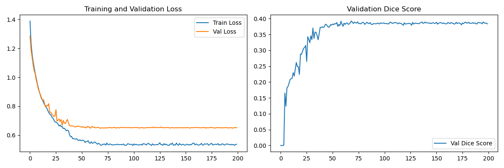
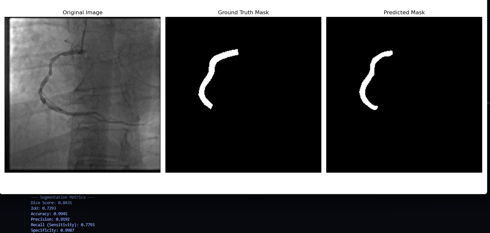
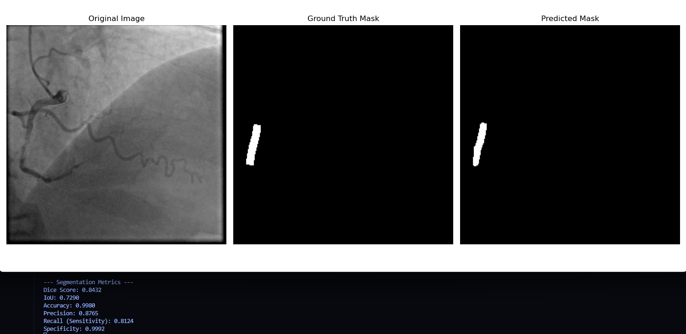
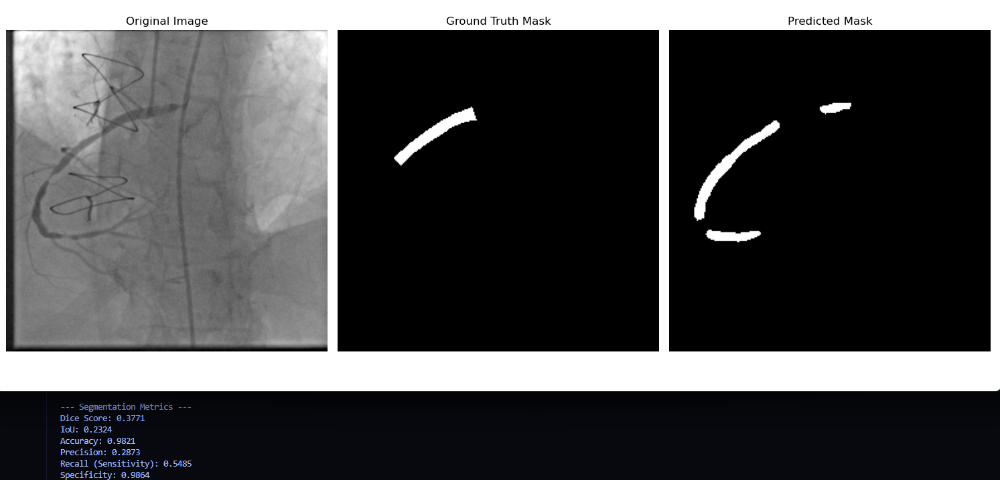
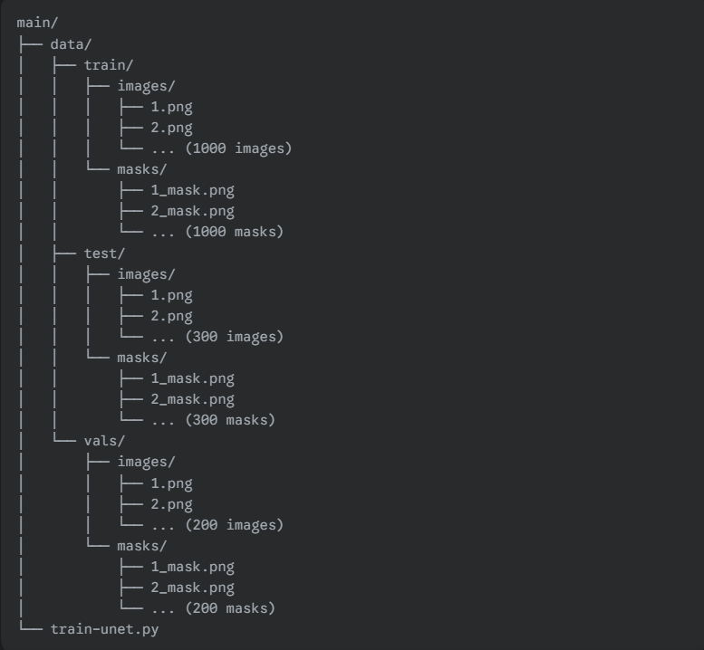

# Deep Learning-Based Segmentation of Atherosclerotic Plaques and Stenosis in Coronary Angiography

[Dataset](https://www.kaggle.com/datasets/ahmedaboenaba/coronary-artery-angiograms-zip)
[Best Model](https://drive.google.com/file/d/1ER_K0142FKconjGEXs31KXTMTrNpcCe9/view?usp=sharing)

# Training Result

## Screenshots of result

### How to use
- Clone repo
- Download [Dataset](https://www.kaggle.com/datasets/ahmedaboenaba/coronary-artery-angiograms-zip)  and [Best Model](https://drive.google.com/file/d/1ER_K0142FKconjGEXs31KXTMTrNpcCe9/view?usp=sharing) and put them in root folder. 
- Run python train.py to train and python predict.py to test. The best model will be saved on root folder as best_unet_model.pth
  
### Folder Structure

