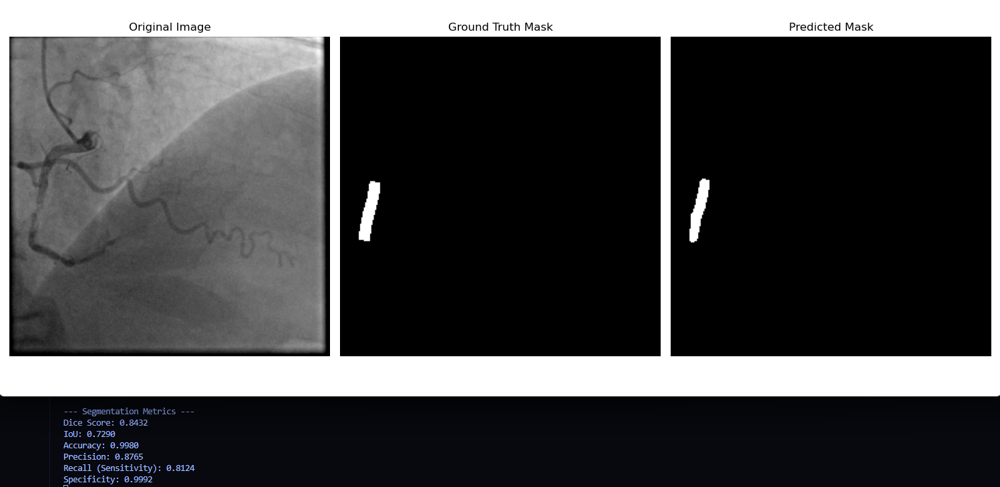
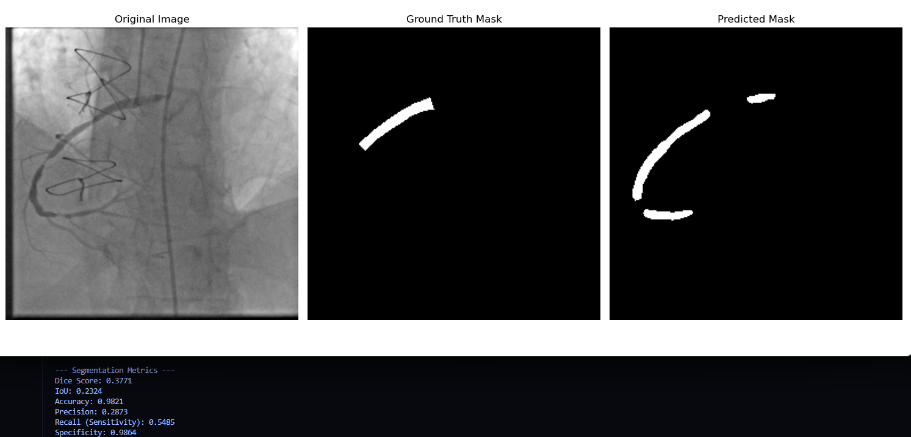

# Deep Learning-Based Segmentation of Atherosclerotic Plaques and Stenosis in Coronary Angiography

[Dataset](https://www.kaggle.com/datasets/ahmedaboenaba/coronary-artery-angiograms-zip)
[Best Model](https://drive.google.com/file/d/1ER_K0142FKconjGEXs31KXTMTrNpcCe9/view?usp=sharing)

#Training Result

##Screenshots of result

